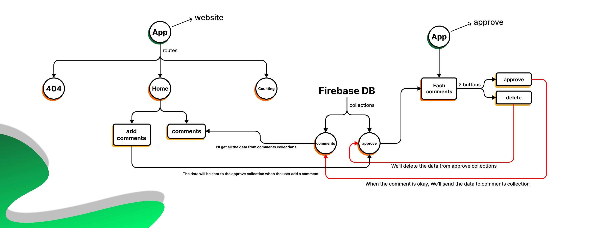

## Technology 

### Teck Stacks

  
  
  
  

### Packages

  
  
  
  

 
## How this website works

| Name | Description | Image |
| :---: | ---- | ----------- |
| WireFrame | I made this digrame that shows what is happening once we add comments and approve... | 

 |
| Style Guide | This is the Style Guide sheet | 

 |
| [Figma](https://www.figma.com/file/J2lJrOoDrITpKEQBZS7tXk/Pie-Tracker?node-id=0%3A1&t=YQ5ja9REIBKmYCrM-1) | Before Coding the website, I designed the website and then coded it | 

 |
| Approve and Delete | When You add a comment, Your comment will be sent to this website which the owner can approve it or delete it | 

 |
| Approved Comment | When your comment was approved, it will be shown in the main website. | 

 |
